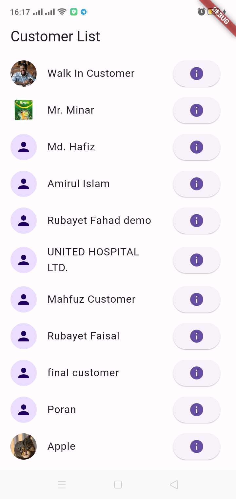

# flutter_application_gtr

## Features implemented
- Implemented provider state management for efficient state management throughout the application.
- Implemented authorization
- showed customer list with pagination
    - The pagination works based on the scrolling.
    - by clicking the button in right side you can see customer details.
- Showed customer image along with its details
- Tried to keep the code clean and ui user friendly. 
## Screenshots of the application

  
  
  

## Apk drive link
[Click here to download the android apk](https://drive.google.com/file/d/1gaQ4RpzEJ9nlfGypO_QcU4V0syO1eNwj/view?usp=sharing)

